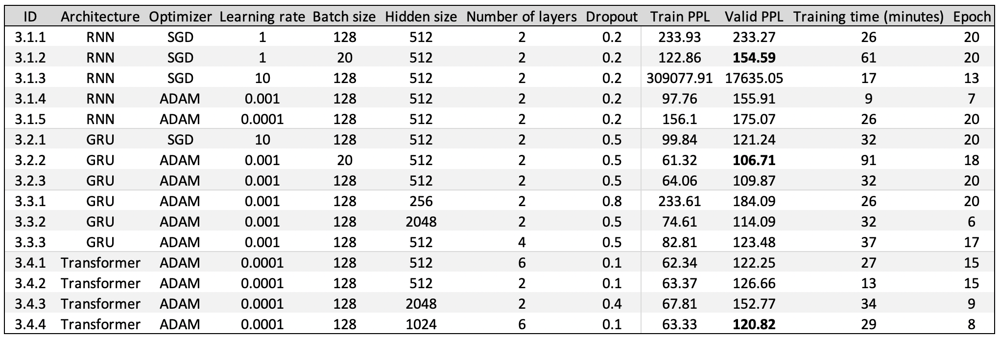

# GRU and Transformer

Content
1. Implementation of a stacked **gated
recurrent units (GRUs)** from a simple RNN implementation
2. Implementation of the **attention module of a transformer**
3. Training of these 3 models (RNN, GRU, and Transformer) on a next-step prediction task
4. Generation of samples by both the RNN and GRU models

## Gated Recurrent Units (GRU)

The model is implemented **from scratch** using PyTorch Tensors,
Variables, and associated operations. It doesn't use built-in Recurrent
modules.

The use of gating can significantly improve the performance of RNNs. The
Long-Short Term Memory (LSTM) RNN is the best known example of gating in
RNNs; GRU-RNNs are a slightly simpler variant (with fewer gates).

Specifically about the implementation, it uses matrix and tensor
operations (e.g. dot, multiply, add, etc.) to implement the recurrent
unit calculations. It uses subclass `nn.module`, built-in Linear
modules, and built-in implementations of nonlinearities (tanh, sigmoid,
and softmax), initializations, loss functions, and optimization
algorithms.

## Multi-head attention module of a transformer

While prototypical RNNs "remember" past information by taking their
previous hidden state as input at each step, recent years have seen a
profusion of methodologies for making use of past information in
different ways. The transformer is one such architecture which uses
several self-attention networks ("heads") in parallel, among other
architectural specifics. The transformer is quite complicated to
implement compared to the RNNs described so far. The project uses
open-source code to implements the different modules that are not the
multi-head attention module (e.g. word embedding map, positional
encoding, and mlp layers).

Note that the implementation of multi-head attention requires binary
masks, so that attention is computed only over the past, not the future.
A mask value of 1 indicates an element which the model is allowed to
attend to (i.e. from the past); a value of 0 indicates an element it
is not allowed to attend to. 

## Training

The sequential language models are trained on the
Penn Treebank dataset. Language models learn to assign a likelihood to
sequences of text. The elements of the sequence (typically words or
individual characters) are called tokens, and can be represented as
one-hot vectors with length equal to the vocabulary size, e.g. 26 for a
vocabulary of English letters with no punctuation or spaces, in the case
of characters, or as indices in the vocabulary for words. In this
representation an entire dataset (or a mini-batch of examples) can be
represented by a 3-dimensional tensor, with axes corresponding to: (1)
the example within the dataset/mini-batch, (2) the time-step within the
sequence, and (3) the index of the token in the vocabulary. Sequential
language models do next-step prediction, in other words, they
predict tokens in a sequence one at a time, with each prediction based
on all the previous elements of the sequence. A trained sequential
language model can also be used to generate new sequences of text, by
making each prediction conditioned on the past *predictions* (instead of
the ground-truth input sequence).

#### The Penn Treebank Dataset

This is a dataset of about 1 million words from about 2,500 stories from
the Wall Street Journal. It has Part-of-Speech annotations and is
sometimes used for training parsers, but it's also a very common
benchmark dataset for training RNNs and other sequence models to do
next-step prediction.

#### Preprocessing

The version of the dataset you will work with has been preprocessed:
lower-cased, stripped of non-alphabetic characters, tokenized (broken up
into words, with sentences separated by the `<eos>` (end of sequence)
token), and cut down to a vocabulary of 10,000 words; any word not in
this vocabulary is replaced by `<unk>`. For the transformer network,
positional information (an embedding of the position in the source
sequence) for each token is also included in the input sequence.

### Loss

Unlike in classification problems, where the performance metric is
typically accuracy, in language modelling, the performance metric is
typically based directly on the cross-entropy loss, i.e. the negative
log-likelihood ($NLL$) the model assigns to the tokens. For word-level
language modelling it is standard to report **perplexity (PPL)**, which
is the exponentiated average per-token NLL (over all tokens):

where t is the index with the sequence, and n indexes different
sequences. For Penn Treebank in particular, the test set is treated as a
single sequence (i.e. N=1). The purpose of this part is to perform
model exploration.

### Results

The three architectures are trained using either stochastic gradient
descent or the ADAM optimizer. The training loop is provided in
*run\_exp.py*. For each experiment (3.1, 3.2, 3.3, 3.4), the learning
curves (train and validation) of PPL over both epochs and
wall-clock-time are in the folder images.

Best Validation PPL for each experiment

## Comparison of generated samples 

Best three (all from the GRU model):

1.  nov. N N `<eos>` the company said it will redeem \$ N million of
    assets and N N of the N N convertible subordinated debentures due
    nov. N N `<eos>` the notes are rated triple-a

2.  N N `<eos>` the key rate of the bills was quoted at N N to yield N
    N `<eos>` the N N N notes due N was N N to N N N to yield

3.  macy & co. said it agreed to acquire its N N stake in the u.s. and
    `<unk>` concern `<eos>` the company said it will sell its N N
    stake in the u.s. and N N

Three interesting:

1.  sachs & co. and salomon brothers inc `<eos>` the move is a
    `<unk>` of the `<unk>` of the `<unk>` `<unk>` of the
    `<unk>` `<unk>` of the `<unk>` `<unk>` `<eos>` the
    `<unk>` `<unk>` `<unk>` `<unk>` `<unk>` `<unk>`
    `<unk>` `<unk>` `<unk>` `<unk>` `<unk>` `<unk>`
    `<unk>` `<unk>` `<unk>` `<unk>` and `<unk>` `<unk>`
    `<eos>` the `<unk>` of the `<unk>` `<unk>` `<unk>`
    `<unk>` `<unk>` `<unk>` `<unk>` `<unk>` `<unk>`
    `<unk>` `<unk>` `<unk>` `<unk>` `<unk>` `<unk>` and\
    It starts promising, but quickly gets in a loop and deteriorates.

2.  at par to yield N N `<eos>` the N N N notes due N fell N to N N to
    yield N N `<eos>` the N N N notes due N fell N to N N to yield N N
    `<eos>` the N N N notes due N fell N to N N to yield N N `<eos>`
    the N N N notes due N fell N to N N\
    The words generated are good, but it gets stuck in a loop.

3.  n't be able to pay the debt `<eos>` the company said it would n't
    identify the offer `<eos>` the company said it would n't elaborate
    `<eos>` the company said it would n't elaborate `<eos>` the
    company said it would n't elaborate `<eos>` the company said it
    would n't elaborate `<eos>` the company said it would n't
    elaborate `<eos>` the company said it will sell its stake in
    navigation mixte to\
    It gets stuck in a loop, but, eventually, gets out of it.

Worst three:

1.  and `<unk>` `<unk>` `<eos>` the `<unk>` `<unk>` `<unk>`
    `<unk>` `<unk>` `<unk>` `<unk>` `<unk>` `<unk>`
    `<unk>` `<unk>` `<unk>` `<unk>` `<unk>` `<unk>`
    `<unk>` `<unk>` `<unk>` and `<unk>` `<unk>` `<eos>` the
    `<unk>` `<unk>` `<unk>` `<unk>` `<unk>` `<unk>`
    `<unk>` `<unk>` `<unk>` `<unk>` `<unk>` `<unk>`
    `<unk>` `<unk>` `<unk>` `<unk>` and `<unk>` `<unk>`
    `<eos>` the `<unk>` `<unk>` `<unk>` `<unk>` `<unk>`
    `<unk>` `<unk>` `<unk>` `<unk>` `<unk>` `<unk>`
    `<unk>` `<unk>` `<unk>` `<unk>` `<unk>` and `<unk>`
    `<unk>` `<eos>` the

2.  of the `<unk>` `<eos>` the `<unk>` `<unk>` `<unk>`
    `<unk>` `<unk>` `<unk>` `<unk>` `<unk>` `<unk>`
    `<unk>` `<unk>` `<unk>` `<unk>` `<eos>` the `<unk>`
    `<unk>` `<unk>` `<unk>` `<unk>` `<unk>` `<unk>`
    `<unk>` `<unk>` `<eos>` the `<unk>` `<unk>` `<unk>`
    `<unk>`

3.  `<eos>` but the company 's `<unk>` `<unk>` `<unk>` `<unk>`
    `<unk>` `<unk>` `<unk>` `<unk>` `<unk>` `<unk>`
    `<unk>` `<unk>` `<unk>` `<unk>` `<eos>` the `<unk>`
    `<unk>` `<unk>` `<unk>` `<unk>` `<unk>` `<unk>`
    `<unk>` `<unk>` `<unk>` `<eos>` the `<unk>` `<unk>`
    `<unk>` `<unk>` `<unk>` `<unk>` `<unk>` `<unk>`
    `<unk>` `<eos>` the `<unk>` `<unk>` `<unk>` `<unk>`
    `<unk>` `<unk>` `<unk>` `<unk>` `<unk>` `<eos>` the
    `<unk>` `<unk>` `<unk>` `<unk>` `<unk>` `<unk>`
    `<unk>` `<unk>` `<unk>` `<eos>` the `<unk>` `<unk>`
    `<unk>` `<unk>`
    
    

March 17th, 2020
